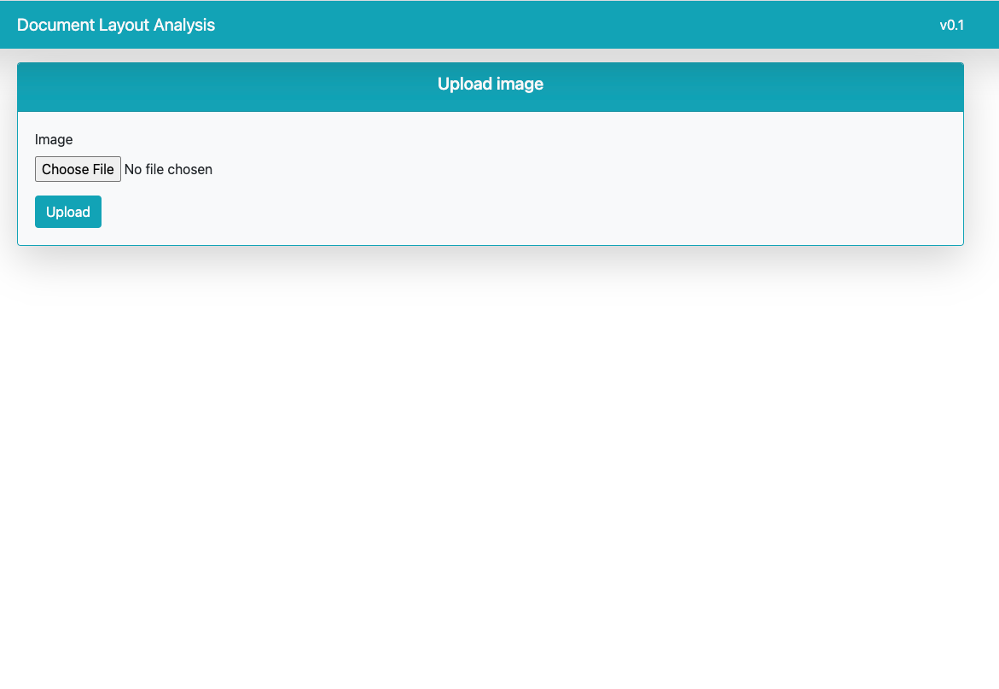
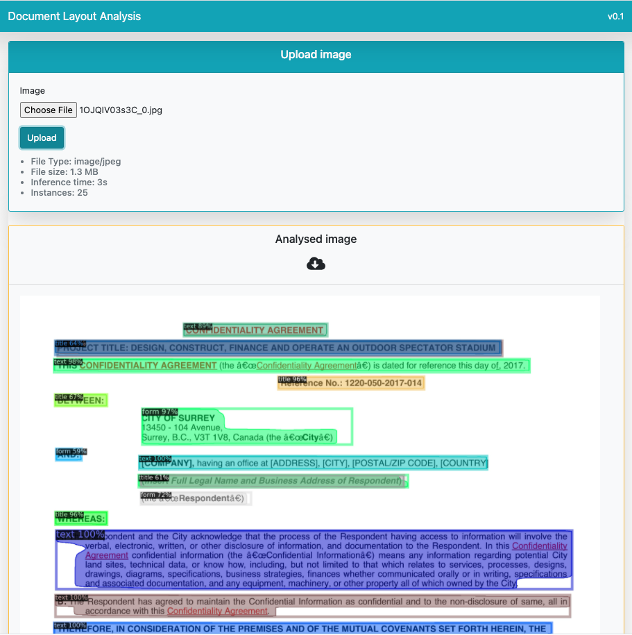

# Document Layout Analysis App
Simple docker deployment of document layout analysis using detectron2. Trained on Publaynet dataset.

### Backend is built in Flask
### Frontend is built in React

### Steps to build
* Run `docker-compose up --build` from the main folder
* Mask RCNN R101 will be auto downloaded
* Type `localhost:3000` in browser and upload and image

### (Optional) To use model other than Mask RCNN R101
* Copy the downloaded model in `backend` folder
* Copy the downloaded config yaml in `backend` folder
* Update the `model_config.yaml` file with model file name and config yaml file name (not required if using default values)
* Run `docker-compose up --build` from the main folder
* Type `localhost:3000` in browser and upload and image

Note: It takes time to build the image

|  |  |
|---------------------------------------------------------------------------|---------------------------------------------------------------------------|
